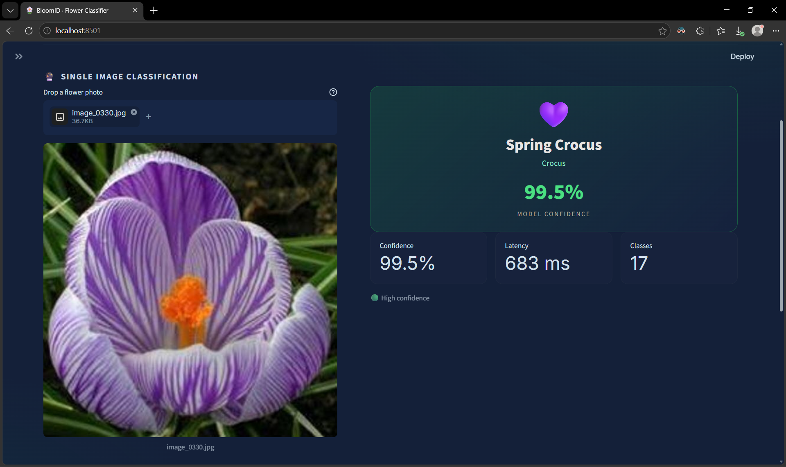

# 🌼 BloomID — Flower Species Classifier

Production-ready web app for a **17-class flower image classifier** built with transfer
learning on an **EfficientNetB0** backbone (2-phase training: frozen feature extraction →
selective fine-tuning).

| Test Accuracy | Top-3 Accuracy | Macro F1 | Test Samples |
|:---:|:---:|:---:|:---:|
| **88.24%** | **96.47%** | **0.8483** | 85 |

---

## Project Structure

```
flower_recognition/
├── app.py                      # Streamlit entry point (Classify / Batch / Model Card)
├── requirements.txt
├── .streamlit/
│   └── config.toml             # App theme configuration
├── assets/
│   └── streamlit_demo.png      # Demo screenshot
├── src/
│   ├── config.py               # Paths, constants, reported test metrics
│   ├── inference.py            # Cached model loading & prediction logic
│   ├── flower_data.py          # Human-readable species metadata
│   └── ui.py                   # Custom CSS design system & Altair charts
├── train.ipynb                 # Full training pipeline (end-to-end, reproducible)
├── artifacts/
│   ├── checkpoints/production_artifacts/   # Deployed model bundle (committed)
│   │   ├── flower_efficientnetb0_production.keras
│   │   ├── class_names.json
│   │   └── model_metadata.json
│   ├── metrics/                # Classification report & training histories
│   └── plots/                  # Learning curves & confusion matrix
└── 17_flowers/                 # Dataset — NOT in git, see "Dataset" below
```

## Demo



## Features

- **🔮 Classify** — single-image prediction with top-K probability chart,
  full class distribution, latency metrics and per-species info cards
- **🗂️ Batch Mode** — multi-image classification with confidence thresholding,
  summary metrics and CSV export
- **🧠 Model Card** — architecture details, live test metrics, training curves and
  confusion matrix rendered straight from the training artifacts

## Quick Start

```bash
# 1. Create & activate a virtual environment
python -m venv .venv
.\.venv\Scripts\activate          # Windows
# source .venv/bin/activate       # Linux / macOS

# 2. Install dependencies
pip install -r requirements.txt

# 3. Run the app
streamlit run app.py
```

> The trained model (`flower_efficientnetb0_production.keras`, ~35 MB) **is committed**,
> so the app runs immediately after cloning — no training required.

## Dataset

The `17_flowers/` image folder is excluded from git to keep the repository lightweight.
To retrain from scratch:

1. Download the [17 Category Flower Dataset](https://www.robots.ox.ac.uk/~vgg/data/flowers/17/)
   (Oxford Visual Geometry Group).
2. Arrange it as class-foldered images:

```
17_flowers/
├── train/<class_name>/*.jpg        # ~80 images per class
└── validation/<class_name>/*.jpg   # ~10 images per class
```

3. Open `train.ipynb` and run all cells — it automatically performs the stratified
   validation/test split, trains both phases, evaluates on the held-out test set and
   exports a fresh production bundle to `artifacts/checkpoints/production_artifacts/`.

## Model Overview

| Property | Value |
|---|---|
| Backbone | EfficientNetB0 (ImageNet weights) |
| Strategy | Phase 1 frozen backbone → Phase 2 top-35 layers unfrozen |
| Input | 224 × 224 × 3 RGB |
| Output | Softmax over 17 species |
| Regularisation | Augmentation-in-graph, dropout, L2, class weights |
| Serving format | Keras `.keras` |

All preprocessing is baked into the saved model graph — inference takes raw RGB pixels.
